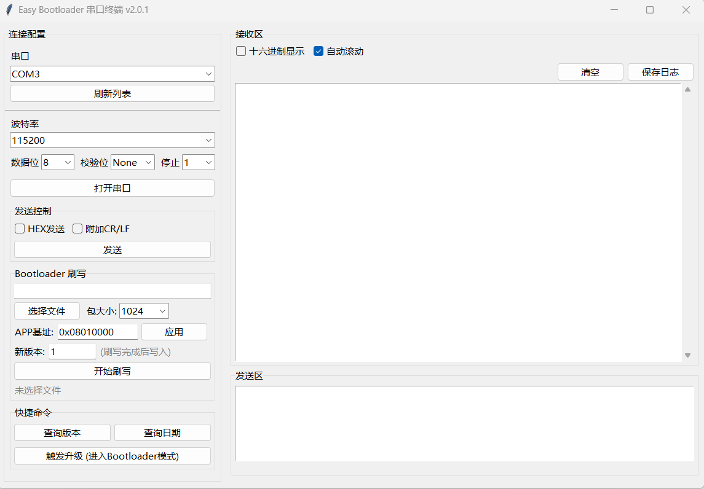

# Easy Bootloader

跨平台 MCU Bootloader 与配套 APP 组件，封装通用的串口刷写协议、升级流程和上位机工具，当前已验证 STM32F4 与 WCH CH32V307，采用最小化移植层设计，方便扩展到更多芯片。


## 功能特性
- **统一协议**：固定帧格式（2B 头 + 3B 剩余 + 2B 长度 + 数据 + 2B 校验 + 2B 尾），最大 1013B/包，并用 ACK `55 AA FF FE 55 55` 保证可靠传输。
- **Bootloader/APP 双组件库**：`easy_bootloader_compoents`（Bootloader 侧）与 `easy_bootloader_app_compoents`（APP 侧）提供一致 API，只需实现 `boot_port_xxx.c` 移植层。
- **串口升级流程**：APP 通过 “触发升级” 命令写 Flag=1 并复位，Bootloader 擦除 APP 区后串行接收数据帧，写入完成再把 Flag=2，自动跳回 APP。
- **上位机终端**：`serial_terminal.py` 用 Tkinter 实现串口调试、版本查询、触发升级和刷写控制，支持 HEX/BIN，含包长配置与 APP 基址校验。
- **示例工程**：`stm32f4_example`（Keil）与 `ch32v307_example`（MounRiver）完整演示 HAL/BSP、调度器、DMA/中断串口等配套代码。


## Bootloader架构

为了进一步节省Flash空间，我们的架构采用的是单APP区加标志位的形式来防止变砖：

```
0x0800_0000  +-------------------------------+
            | Bootloader 区                  |
            | 例如 20KB~30KB                 |
0x0800_____  +-------------------------------+
            | APP 区                        |
            | 例如剩余所有空间                     |
0x0800_____  +-------------------------------+
            | FLag 区           				|
            | 例如 1KB-2kB                  |
0x080X_XXXX  +-------------------------------+
```


## 目录结构
- `easy_bootloader_compoents/`：Bootloader 核心（公共 `easy_bootloader.c/h` 与 `boot_config.h`）。
- `easy_bootloader_app_compoents/`：APP 触发升级模块。
- `stm32f4_example/`：F407 Bootloader/APP 工程及 BSP 示例。
- `ch32v307_example/`：CH32V307 Bootloader/APP 工程（RISC‑V）。
- `PC tool/`：上位机工具目录
  - `Easy_Bootloader_串口终端.exe`：打包好的 Windows 可执行文件，可直接运行。
  - `source/serial_terminal.py`：Python 源码，需 Python3 + `pip install pyserial`。
- `协议.md`：架构与协议说明，推荐先阅读。


## 快速上手
1. **选择芯片**：拷贝对应示例工程（或参考 `easy_bootloader_*` 组件），根据芯片资料完成 `boot_port_xxx.c` 移植层：
   - Flash 擦写（扇区/页对齐、4 字节写入）。
   - UART 读写（建议 DMA+空闲中断或环形缓冲）。
   - `boot_port_get_tick`、`boot_port_jump_to_app`、`boot_port_system_reset` 等必要接口。
2. **配置 `boot_config.h`**：设置架构、Flash 区间、SRAM 范围、Flag 区地址。
3. **修改链接脚本**：将对应MCU的链接脚本修改为配置文件相同。
4. **编译/下载**：先烧写 Bootloader，再刷写 APP（APP 的链接地址需与 `BOOT_APP_START_ADDR` 一致）。
5. **运行上位机**：
   - **方式一（推荐）**：直接运行 `PC tool/Easy_Bootloader_串口终端.exe`，无需安装 Python 环境。
   - **方式二**：`cd "PC tool/source" && python serial_terminal.py`（需 Python3 + pyserial）。

   选择串口、HEX 文件、包长与 APP 基址后点击"开始刷写"；也可先在 APP 中用"触发升级"按钮写 Flag=1，再刷新固件。


## 升级流程示意
1. APP 运行中 -> 上位机发送"触发升级"命令。
2. APP 发送 ACK 确认，写 Flag=1 后复位进入 Bootloader。
3. Bootloader 检测 Flag=1，留在刷写模式并擦除 APP 区。
4. 上位机按包发送固件，每包等待 ACK；Bootloader 写入 Flash。
5. 最后一包完成（剩余字节=0），Bootloader 进入等待完成帧状态。
6. 上位机发送完成帧（包含版本号和更新日期），Bootloader 写入 Flag=2 及版本信息。
7. Bootloader 发送 ACK 后复位，自动跳转到 APP，新版本开始运行。

**注意**：

* 首次烧录bootloader程序之后，会停留在bootloder程序中等待第一次刷写，刷写成功后进入到APP程序中进行运行，之后升级就	可以通过上位机的触发升级来完成升级。
* 在对接时强烈建议对bootloader串口使用DMA加环形缓存区来实现数据流转，以防出现丢包导致刷写中断等问题。


## 上位机界面




## 版本更新记录

### v2.0 (2025-12-15)
- **新增完成帧机制**：解决了之前触发升级后立即写入版本信息的逻辑问题。现在版本号和更新日期由上位机在数据传输完成后通过完成帧（`0xFF 0xFD`）发送，Bootloader 收到完成帧后才写入标志位区并复位。
- **状态机优化**：Bootloader 新增三态状态机（IDLE → RECEIVING → WAIT_FINISH），确保刷写流程更加健壮。
- **协议完善**：完成帧格式为 `55 AA [ver 4B] [date 4B] FF FD 55 55`（14字节）。


## 贡献与扩展

欢迎提交 PR 或 Issue：例如增加更多移植模板（GD32、STM32H7 等）、改进上位机 GUI、支持 CRC/FEC、引入链路加密等。提交前请确保：
- 新平台的 `boot_port_xxx.c` 包含完整 Flash/UART/跳转实现。
- 示例工程能编译通过，并附测试说明（刷写日志、串口输出等）。
