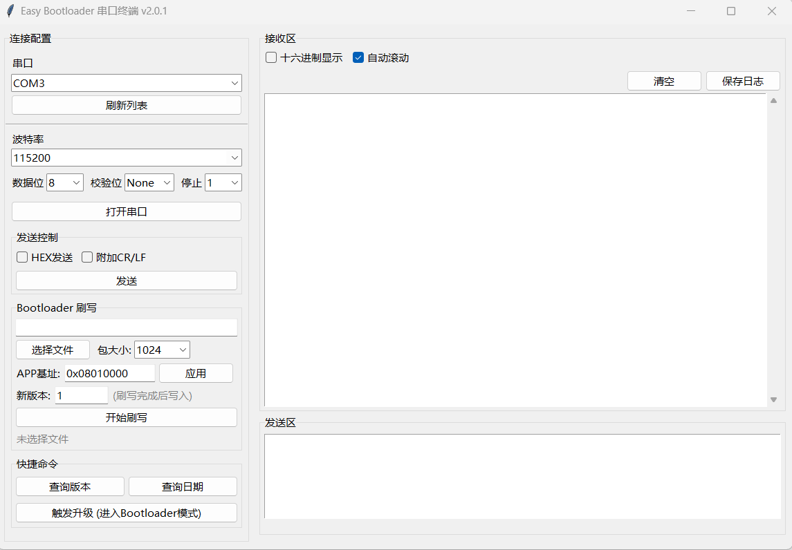

# Easy Bootloader

面向 STM32F407 的裸机 Bootloader 与配套 APP 组件，封装串口刷写协议、升级流程和上位机工具。当前仓库仅维护 STM32F4 示例。


## 功能特性
- **统一协议**：固定帧格式（2B 头 + 3B 剩余 + 2B 长度 + 数据 + 2B 校验 + 2B 尾），最大 1013B/包，并用 ACK `55 AA FF FE 55 55` 保证可靠传输。
- **Bootloader/APP 双组件库**：`easy_bootloader_compoents`（Bootloader 侧）与 `easy_bootloader_app_compoents`（APP 侧）通过 `boot_loader_ops_t` / `boot_app_ops_t` 对接板级接口。
- **断电恢复升级流程**：APP 把固件下载到外部 Flash 的非活动 A/B 槽，回读校验后提交 BCB 并复位；Bootloader 再安装到内部 APP 区，失败时可从已确认槽回滚。
- **上位机终端**：`serial_terminal.py` 用 Tkinter 实现串口调试、版本查询和一键升级，支持 HEX/BIN，含包长配置与 APP 基址校验。
- **示例工程**：`stm32f4_example`（Keil）完整演示 HAL/BSP、调度器、DMA 环形缓冲等配套代码。


## Bootloader 架构

内部 Flash 保留单 APP 区，外部 W25Q128 使用 A/B 镜像槽；BCB 是内部 Flash 中的追加式启动控制记录区：

```
0x0800_0000  +-------------------------------+
            | Bootloader 区（48KB）           |
0x0800_C000  +-------------------------------+
            | BCB 区（Sector 3，16KB）         |
0x0801_0000  +-------------------------------+
            | 内部 APP 区                    |
            | 960KB                          |
0x0810_0000  +-------------------------------+

外部 W25Q128：Slot A 2MB，Slot B 1MB；每槽前 64B 为带 CRC 和提交标记的镜像头。
```

内部 Flash 只有一个 APP 执行区。A/B 是外部 Flash 中的两份镜像仓库：`confirmed_slot` 保存已确认版本，`pending_slot` 保存候选版本。候选版本未确认前，确认槽绝不会被覆盖。


## 目录结构
- `easy_bootloader_compoents/`：Bootloader 核心（公共 `easy_bootloader.c/h` 与 `boot_config.h`）。
- `easy_bootloader_app_compoents/`：APP 外部 Flash 下载与确认模块。
- `stm32f4_example/`：F407 Bootloader/APP 工程及 BSP 示例。
- `PC tool/`：上位机工具目录
  - `Easy_Bootloader_串口终端_v2.1.0.exe`：打包好的 Windows 可执行文件，可直接运行。
  - `source/serial_terminal.py`：Python 源码，需 Python3 + `pip install pyserial`。
- [协议.md](协议.md)：串口线协议速查。
- [框架详解.md](框架详解.md)：当前 A/B 槽、BCB、下载、安装、试运行和断电恢复机制的完整说明。


## 快速上手
1. **打开 STM32F407 示例工程**：从 `stm32f4_example/` 启动，再迁移到你的板级工程。
2. **对接 Bootloader 板级接口**：以 `boot_port_stm32f407.c` 为基础，接入 Flash、串口、跳转、复位和日志接口。
3. **绑定 Boot ops**：组装 `boot_loader_ops_t boot_port_ops`，初始化时调用 `easy_bootloader_init(&config, &boot_port_ops)`。
4. **对接 APP 板级接口**：以 `boot_port_app_stm32f407.c` 为基础，接入 BCB、外部 A/B 槽、串口、复位和日志接口。
5. **绑定 APP ops**：组装 `boot_app_ops_t boot_port_app_ops`，初始化时调用 `easy_bootloader_app_init(&config, &boot_port_app_ops)`。
6. **配置与链接**：设置 `boot_config.h` / `boot_config_app.h`（地址、缓冲），并保证链接脚本中的 APP 起始地址与配置一致。
7. **首次烧录**：先烧写 Bootloader 到 `0x08000000`，再烧写 APP 到 `0x08010000`。下载 APP 时选择 `Erase Sectors`，不要选 `Erase Full Chip`。
8. **连接串口**：UART1（`PA9/PA10`）用于日志；升级使用 USART3（`PD8=TX`、`PB11=RX`，115200）。USB 串口需交叉连接：`TX -> PB11`、`RX -> PD8`、GND 共地。
9. **运行上位机**：
   - **方式一（推荐）**：直接运行 `PC tool/Easy_Bootloader_串口终端_v2.1.0.exe`。
   - **方式二**：`cd "PC tool/source" && python serial_terminal.py`（需 Python3 + pyserial）。

   选择升级串口、固件和包长后点击“开始升级”。建议选择 APP 工程新编译出的 `.bin`；默认 APP 基址 `0x08010000` 只用于校验 `.hex` 文件。工具会自动建立下载会话，无需单独触发。


## 升级与回滚流程

### 首次升级
1. 初始 APP 正运行于内部 Flash，BCB 和外部 A/B 槽均为空。
2. APP 接收新固件并下载到 A 槽，逐包回读，整包 CRC 通过后提交 `UPDATE_READY` 并复位。
3. Bootloader 先把当前内部 APP 备份到 B 槽，再将 A 槽安装到内部 APP 区。
4. 新 APP 以 `TRIAL` 状态运行；示例工程约 3 秒后确认成功，A 槽成为 `confirmed_slot`。

### 后续升级与自动回滚
1. 已确认槽为 A 时，新包只能下载到 B；已确认槽为 B 时，新包只能下载到 A。
2. 候选槽写入或 CRC 校验失败时，BCB 不会提交升级状态，当前内部 APP 和确认槽保持不变。
3. 候选镜像校验通过后才会安装到内部 APP 区，并进入 `TRIAL`。
4. 候选 APP 在确认前启动异常、内部 CRC/向量表异常，或连续复位超过默认 2 次时，Bootloader 从旧 `confirmed_slot` 重新安装并回滚。
5. 只有新 APP 主动确认后，候选槽才成为新的 `confirmed_slot`；下一次升级再切换到另一槽。

典型日志：`slot 1 ready` 表示 A 槽下载校验成功；`initial App backed up to slot 2` 表示旧内部 APP 已备份到 B 槽；`trial boot 1/2 from slot 1` 表示正在试运行 A 槽版本。确认后，下次升级日志应显示 `target slot=2`。

**注意**：

* 仅有 Bootloader 且内部 APP 无效时，设备会停留在 Bootloader；先通过调试器烧录一个初始 APP，之后即可由 APP 完成在线下载。
* 当前架构中升级数据由 APP 接收，Bootloader 不接收升级串口数据；APP 升级口应使用 DMA 加环形缓冲，避免丢包导致刷写中断。
* 示例的 3 秒确认仅用于联调。量产前请替换为真实健康检查，例如关键外设、配置、主任务和看门狗链路均正常后再确认。


## 上位机界面




## 版本更新记录

### v3.0 (2026-03-04)
- **接口模式升级**：Boot 与 APP 统一切换为配置加 ops 注入模式：`easy_bootloader_init(const boot_loader_config_t *, const boot_loader_ops_t *)`、`easy_bootloader_app_init(const boot_app_config_t *, const boot_app_ops_t *)`。
- **板级接口解耦**：核心通过 ops 集合调用 STM32F407 板级的 Flash、串口和系统接口。
- **示例工程同步**：STM32F4 示例完成新接口同步，调度器改为通过 `bootloader_app_init()` 封装入口绑定 ops。
- **文档更新**：快速上手章节补充了 ops 绑定步骤，减少移植时接口对不上导致的集成问题。

### v2.0 (2025-12-15)
- **新增完成帧机制**：版本号和更新日期由上位机在数据传输完成后通过完成帧（`0xFF 0xFD`）发送。
- **状态机优化**：下载端采用 IDLE → RECEIVING → WAIT_FINISH 流程，确保刷写过程更加健壮。
- **协议完善**：完成帧格式为 `55 AA [ver 4B] [date 4B] FF FD 55 55`（14字节）。


## 贡献与扩展

欢迎提交 PR 或 Issue：例如改进 STM32F407 的 Flash/UART 实现、上位机 GUI、CRC/FEC 或链路加密。提交前请确保：
- `boot_port_stm32f407.c` 包含完整的 Flash/UART/跳转实现。
- 示例工程能编译通过，并附测试说明（刷写日志、串口输出等）。
