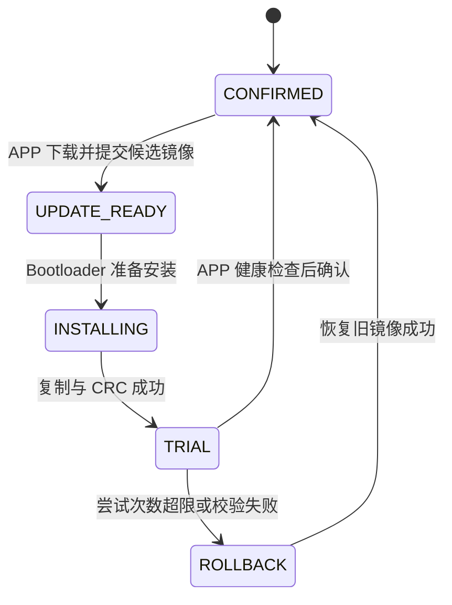
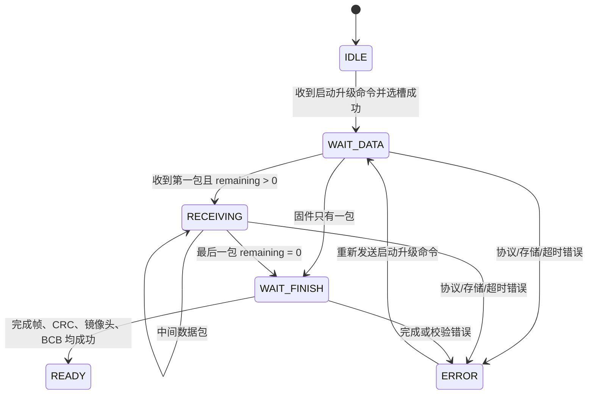
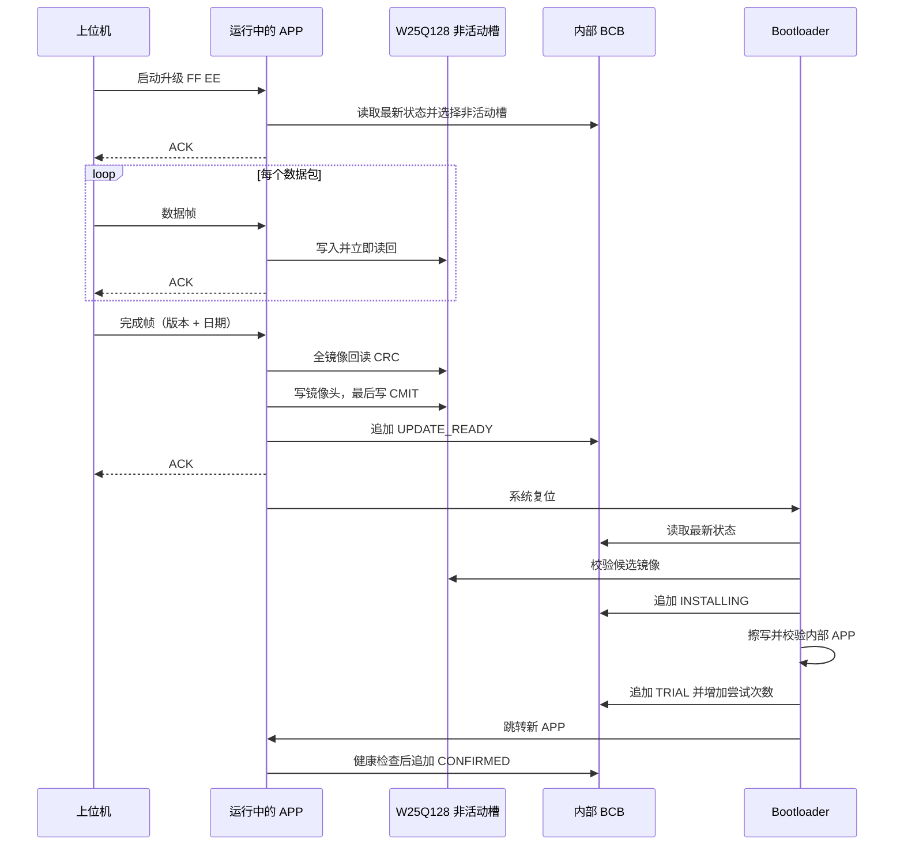

# Easy Bootloader 框架详解

本文以仓库当前代码为准，完整说明 STM32F407 + W25Q128 升级框架的组成、存储布局、通信协议、APP 下载状态机、Bootloader 安装与回滚状态机、BCB 断电保护机制，以及移植和验证方法。

> 当前方案不是“Bootloader 通过串口直接接收固件”，也不是旧版“Flag=1/2”模型。现在的职责划分是：**APP 负责下载，外部 Flash A/B 槽负责保存镜像，BCB 负责记录事务状态，Bootloader 负责安装和回滚。**

阅读建议：第一次了解框架可依次阅读第 2、4、5、7、8、9、10、14 节；准备移植时重点阅读第 3、15、16、17 节；定位问题时直接查看第 18、19、20 节。

## 1. 设计目标

本框架解决的是单片机内部只保留一个 APP 执行区时，如何尽量可靠地完成在线升级：

- 正常运行期间由 APP 接收固件，不让 Bootloader 长时间处理通信协议。
- 新固件先完整落盘到外部 Flash，校验成功前不修改内部 APP。
- 外部 Flash 使用 A/B 镜像槽交替保存当前确认镜像和下一次候选镜像。
- 内部 Flash 使用 BCB 追加记录描述升级事务，避免依赖一个容易产生歧义的单值 Flag。
- Bootloader 在复位后根据 BCB 状态完成安装、试运行、确认或回滚。
- 关键数据均使用“内容先写、提交标记最后写”的方式识别断电导致的半写记录。

框架并没有把内部 APP 做成真正的双 Bank。设备仍然只有一个内部 APP 执行区，外部 A/B 槽保存可安装、可回滚的镜像副本。

## 2. 总体架构

```text
┌──────────────────────────────────────────────────────────┐
│                      PC 上位机                            │
│  选择 HEX/BIN -> 启动会话 -> 分包发送 -> 完成帧 -> 等 ACK │
└────────────────────────────┬─────────────────────────────┘
                             │ UART3
┌────────────────────────────▼─────────────────────────────┐
│                     运行中的 APP                          │
│  协议解析 | 选择非活动槽 | 擦写外部 Flash | CRC | 提交 BCB │
└──────────────┬──────────────────────────────┬────────────┘
               │                              │
               │ W25Q128                      │ 内部 Flash
┌──────────────▼──────────────────┐  ┌────────▼─────────────┐
│ 外部 Flash                      │  │ BCB Sector 3          │
│ Slot A: 镜像头 + 固件           │  │ 追加式状态记录         │
│ Slot B: 镜像头 + 固件           │  └────────┬─────────────┘
└──────────────┬──────────────────┘           │ reset
               │                              │
┌──────────────▼──────────────────────────────▼────────────┐
│                       Bootloader                          │
│  读取 BCB -> 校验槽镜像 -> 备份/安装 -> TRIAL -> 回滚判断 │
└────────────────────────────┬─────────────────────────────┘
                             │ jump
┌────────────────────────────▼─────────────────────────────┐
│                  内部 APP 0x08010000                      │
└──────────────────────────────────────────────────────────┘
```

各模块的核心职责如下：

| 模块 | 主要职责 | 不负责的事情 |
|---|---|---|
| 上位机 | 解析固件、建立会话、分包、ACK 节流、发送版本和日期 | 不决定 A/B 目标槽 |
| APP 下载组件 | 接收协议、选择非活动槽、外部 Flash 擦写与回读、提交 `UPDATE_READY` | 不擦写内部 APP |
| BCB 公共组件 | BCB 编解码、CRC、追加、查找最新记录、回收 | 不决定业务状态跳转 |
| 镜像公共组件 | 镜像头编解码和 CRC32 | 不执行 Flash I/O |
| Bootloader | 根据 BCB 安装、试运行、重试、回滚、跳转 | 当前不接收串口固件 |
| STM32 端口层 | HAL、W25Q128、内部 Flash、UART、跳转和复位适配 | 不实现升级业务状态机 |

## 3. 仓库结构与源码归属

```text
easy_bootloader_project/
├── easy_bootloader_common/                 # Boot 与 APP 共用
│   ├── inc/boot_control.h                  # BCB 数据结构/API
│   ├── inc/boot_image.h                    # 镜像头/API
│   ├── src/boot_control.c                  # BCB 追加记录实现
│   └── src/boot_image.c                    # 镜像头与 CRC32
├── easy_bootloader_compoents/              # Bootloader 组件源
│   ├── inc/boot_config.h
│   ├── inc/easy_bootloader.h
│   ├── src/easy_bootloader.c
│   ├── src/boot_port_stm32f407.c
│   └── tests/
├── easy_bootloader_app_compoents/          # APP 下载组件源
│   ├── inc/boot_config_app.h
│   ├── inc/easy_bootloader_app.h
│   ├── src/easy_bootloader_app.c
│   ├── src/boot_port_app_stm32f407.c
│   └── tests/
├── stm32f4_example/                        # Keil 示例工程
├── serial_terminal.py                      # 上位机主源码
├── PC tool/source/serial_terminal.py       # 上位机发布副本
├── 协议.md                                 # 线协议速查
└── 框架详解.md                             # 本文档
```

开发时优先修改根目录组件。`stm32f4_example/.../Compoents/` 是供 Keil 工程直接引用的拷贝版，相关修改必须同步。生成的 `.o`、`.d`、`.map`、`.hex`、`.axf` 等文件不是手工维护对象。

## 4. Flash 布局

### 4.1 STM32F407 内部 Flash

当前配置针对 1MB 内部 Flash：

```text
0x08000000  ┌──────────────────────────────┐
            │ Bootloader                  │ 48KB，Sector 0~2
0x0800C000  ├──────────────────────────────┤
            │ BCB                         │ 16KB，Sector 3
0x08010000  ├──────────────────────────────┤
            │ APP 执行区                  │ 960KB，Sector 4~11
0x08100000  └──────────────────────────────┘
```

| 区域 | 起始地址 | 大小 | 代码配置 |
|---|---:|---:|---|
| Bootloader | `0x08000000` | 48KB | `BOOT_BOOTLOADER_START_ADDR` / `BOOT_BOOTLOADER_SIZE` |
| BCB | `0x0800C000` | 16KB | `BOOT_BCB_REGION_ADDR` / `BOOT_BCB_REGION_SIZE` |
| APP | `0x08010000` | 960KB | `BOOT_APP_START_ADDR` / `BOOT_APP_MAX_SIZE` |

APP 的 Keil 链接地址必须是 `0x08010000`。如果链接地址与配置不一致，即使下载和 CRC 都正确，复位向量也会指向错误位置。

### 4.2 W25Q128 外部 Flash

W25Q128 总容量为 16MB，当前 OTA 组件只使用以下两个区域：

```text
0x00200000  ┌──────────────────────────────┐
            │ Slot A                      │ 2MB
0x00400000  ├──────────────────────────────┤
            │ Slot B                      │ 1MB
0x00500000  └──────────────────────────────┘
```

| 槽 | 外部 Flash 偏移 | 大小 | 最大有效负载 |
|---|---:|---:|---:|
| A | `0x00200000` | 2MB | 2MB - 64B |
| B | `0x00400000` | 1MB | 1MB - 64B |

每个槽的前 64B 是镜像头，固件数据从槽内偏移 `0x40` 开始。框架配置把固件最大尺寸限制为 960KB，因此 A、B 两槽都能容纳内部 APP 的完整镜像。

外部 Flash 中未列出的区域当前不由 OTA 组件管理。实际产品若还存放资源、参数或音频数据，必须保证分区不重叠。

## 5. A/B 槽的真实含义

这里的 A/B 是**外部固件仓库**，不是两个可以直接执行的内部 APP：

- `confirmed_slot`：其镜像内容与当前已确认的内部 APP 对应，是回滚来源。
- `pending_slot`：已下载但尚未确认的新镜像来源。
- APP 总是把新固件写到 `confirmed_slot` 的另一槽。
- Bootloader 把 `pending_slot` 的固件复制到唯一的内部 APP 区。
- 新 APP 确认成功后，`pending_slot` 才升级为新的 `confirmed_slot`。

槽选择规则：

```text
confirmed A -> 下一包下载到 B
confirmed B -> 下一包下载到 A
尚无 confirmed_slot -> 首次下载到 A
```

典型交替过程：

```text
初始内部 APP，BCB 为空
  -> 新固件下载 A
  -> Bootloader 把初始内部 APP 备份到 B
  -> 安装 A，确认后 confirmed=A
  -> 下一版下载 B，安装并确认后 confirmed=B
  -> 再下一版下载 A，继续交替
```

首次备份按当前配置复制完整的 960KB 内部 APP 区，而不是根据链接产物推断实际代码长度，因此 Slot B 的有效负载必须至少容纳 `BOOT_APP_MAX_SIZE`。

在 `TRIAL` 期间，旧 `confirmed_slot` 不会被覆盖，因此新 APP 未确认时仍有可验证的回滚镜像。

## 6. 外部镜像格式

镜像头由 `boot_image_info_t` 表示，占 64B，磁盘字段使用小端序：

| 偏移 | 大小 | 字段 | 说明 |
|---:|---:|---|---|
| `0x00` | 4B | magic | `EBM1` 标识 |
| `0x04` | 2B | format_version | 当前为 1 |
| `0x06` | 2B | header_size | 固定 64 |
| `0x08` | 4B | target_address | 当前必须为 `0x08010000` |
| `0x0C` | 4B | firmware_version | 上位机提供的版本号 |
| `0x10` | 4B | build_date | `0xYYYYMMDD` |
| `0x14` | 4B | payload_offset | 固定 64 |
| `0x18` | 4B | payload_size | 固件实际长度 |
| `0x1C` | 4B | payload_crc32 | 固件 CRC32 |
| `0x20` | 4B | flags | 预留 |
| `0x24` | 20B | reserved | 保持擦除值 |
| `0x38` | 4B | header_crc32 | 对 `0x00~0x37` 计算 CRC32 |
| `0x3C` | 4B | commit_marker | `CMIT`，最后写入 |

镜像写入顺序是：

1. 先把固件写到槽内 `0x40` 之后。
2. 从外部 Flash 重新读取全部固件并计算 CRC32。
3. 写镜像头的前 60B。
4. 最后单独写 4B `CMIT` 提交标记。
5. 再读取完整镜像头并解码校验。

因此在镜像头写入中途断电时，提交标记不存在，`boot_image_header_decode()` 会拒绝该镜像。CRC32 使用多项式 `0xEDB88320` 的常见反射实现，初始值为 `0xFFFFFFFF`，结束时按位取反。

## 7. BCB 是什么

BCB 是 Boot Control Block，即启动控制块。它不是一个 Flag 字，而是一段追加式事务日志。

当前 BCB 位于内部 Flash Sector 3：

- 区域大小：16KB。
- 单条记录：64B。
- 总容量：256 条记录。
- 每次状态改变追加一条新记录，不原地覆盖旧记录。
- 启动时扫描全部记录，选择 CRC、提交标记均有效且 `sequence` 最大的一条。

### 7.1 BCB 记录布局

| 偏移 | 大小 | 字段 | 说明 |
|---:|---:|---|---|
| `0x00` | 4B | magic | `BCB1` |
| `0x04` | 2B | format_version | 当前为 1 |
| `0x06` | 2B | record_size | 固定 64 |
| `0x08` | 4B | sequence | 单调递增序号 |
| `0x0C` | 4B | state | 当前事务状态 |
| `0x10` | 4B | confirmed_slot | 当前确认槽 |
| `0x14` | 4B | pending_slot | 待安装/试运行槽 |
| `0x18` | 4B | confirmed_version | 已确认版本 |
| `0x1C` | 4B | pending_version | 候选版本 |
| `0x20` | 4B | image_size | 当前事务镜像长度 |
| `0x24` | 4B | image_crc32 | 当前事务镜像 CRC |
| `0x28` | 1B | boot_attempts | 已试运行次数 |
| `0x29` | 1B | max_boot_attempts | 最大试运行次数 |
| `0x2A` | 2B | reserved | 预留 |
| `0x2C` | 4B | last_error | 错误信息预留 |
| `0x30` | 4B | flags | 扩展标志预留 |
| `0x34` | 4B | record_crc32 | 对 `0x00~0x33` 计算 CRC32 |
| `0x38` | 4B | commit_marker | `CMIT`，最后写入 |
| `0x3C` | 4B | reserved | 预留 |

BCB 追加时先写前 56B，再单独写提交标记。若中途断电，半写记录不会成为最新有效状态，Bootloader 会继续使用上一条完整记录。

### 7.2 为什么要追加记录

若只使用单个 Flag，擦除或改写 Flag 时断电，原状态和新状态可能同时丢失。追加日志则保留上一条已提交记录，新记录只有在 CRC 和提交标记同时有效时才生效。

APP 在接受升级前要求至少保留 `BOOT_CONTROL_UPDATE_RECORD_RESERVE`，当前为 8 条空记录，用来给后续安装、试运行、确认或回滚状态预留空间。STM32 APP 端口禁止擦除 BCB；BCB 回收只允许由 Bootloader 在已确认的内部 APP 和外部镜像都验证通过时执行。

## 8. BCB 状态机

| 状态 | 含义 | 复位后 Bootloader 行为 |
|---|---|---|
| `EMPTY` | 没有有效控制记录 | 内部 APP 向量有效则直接启动 |
| `CONFIRMED` | 内部 APP 已确认，外部确认槽可回滚 | 校验内部 APP，成功则启动，失败则回滚 |
| `UPDATE_READY` | 候选镜像已完整落盘并提交 | 首次升级先备份旧 APP，然后安装候选镜像 |
| `BACKUP_READY` | 首次升级的旧内部 APP 已备份 | 继续安装候选镜像 |
| `INSTALLING` | 内部 APP 可能正在擦写 | 重新从候选槽安装，失败则回滚 |
| `TRIAL` | 新 APP 已安装但尚未确认 | 增加尝试次数并启动；超限则回滚 |
| `ROLLBACK` | 要求恢复已确认镜像 | 从 `confirmed_slot` 恢复内部 APP |
| `ERROR` | 预留错误态 | 当前 Bootloader 将其视为无法处理的 BCB 状态 |

正常升级的主要状态序列：



首次升级多一步备份：

```text
EMPTY
  -> APP 把新镜像下载到 A
  -> UPDATE_READY(pending=A, confirmed=NONE)
  -> Bootloader 把当前内部 APP 备份到 B
  -> BACKUP_READY(pending=A, confirmed=B)
  -> INSTALLING
  -> TRIAL(pending=A, confirmed=B)
  -> CONFIRMED(confirmed=A)
```

## 9. APP 下载状态机

APP 侧核心位于 `easy_bootloader_app.c`，不直接依赖 STM32 HAL。它通过 `boot_app_ops_t` 调用串口、外部存储和 BCB 接口。



### 9.1 启动会话

上位机发送：

```text
55 AA FF EE 55 55
```

APP 只在 BCB 为 `EMPTY` 或 `CONFIRMED` 时允许新下载。然后按以下规则选择目标槽：

- 已确认 A：目标 B。
- 已确认 B：目标 A。
- 没有确认槽：目标 A。
- `UPDATE_READY`、`INSTALLING`、`TRIAL` 等未完成事务状态：返回忙，不发送 ACK。

选槽成功后 APP 进入 `WAIT_DATA` 并返回 ACK。启动命令本身不会复位，也不会修改内部 APP。

### 9.2 第一包和擦除

APP 从第一包计算固件总长度：

```text
total_size = received_size + payload_length + remaining
```

随后只擦除目标槽中实际需要的范围：

```text
align_up(64B 镜像头 + total_size, 4KB)
```

STM32 端口每擦除一个 4KB 扇区后，会把整个扇区分块读回并确认均为 `0xFF`。因此第一包耗时明显长于后续包，上位机给第一包设置了 60 秒 ACK 超时。

### 9.3 数据包写入

每一包都要同时满足：

- 帧头、帧尾正确。
- 数据长度在 `1~1013` 之间。
- 帧校验和正确。
- 每包推导出的固件总长度与第一包一致。
- 累计长度不超过槽容量和 960KB 配置上限。

数据写入位置是：

```text
slot_base + 64 + received_size
```

STM32 端口以最多 512B 的块写 W25Q128，并立即读回比较。只有写入和回读一致后才向上位机发送 ACK。APP 同时对接收到的原始固件维护流式 CRC32。

### 9.4 完成和提交

最后一包的 `remaining=0`，APP 转入 `WAIT_FINISH`。收到完成帧后：

1. 获取版本号和 `0xYYYYMMDD` 日期。
2. 从外部 Flash 重新读取全部固件。
3. 重新计算 CRC32，并与接收阶段的 CRC32 比较。
4. 写入镜像头，提交标记最后写。
5. 读取并解码镜像头。
6. 检查 BCB 剩余记录数量。
7. 追加 `UPDATE_READY`，写入目标槽、版本、长度和 CRC。
8. 返回完成 ACK。
9. 调用 `NVIC_SystemReset()`。

只有第 7 步成功后 Bootloader 才会认为有待安装升级。部分下载、无提交头的镜像或没有 BCB 指向的孤立镜像都不会自动安装。

### 9.5 查询和确认

APP 还处理两个查询命令：

- `55 AA FF DD 55 55`：返回 `version:<数字>\r\n`。
- `55 AA FF CC 55 55`：返回 `YYYY-MM-DD\r\n`。

STM32 APP 启动时根据 BCB 判断当前运行镜像：

- `TRIAL` 使用 `pending_slot` 的镜像头。
- `CONFIRMED` 使用 `confirmed_slot` 的镜像头。

由此加载运行版本和构建日期。示例工程在 APP 启动约 3 秒后调用 `easy_bootloader_app_confirm_running()`，把 `TRIAL` 转为 `CONFIRMED`。产品化时，这个固定延时应替换或补充为真实健康条件，例如关键外设初始化成功、配置加载成功、主任务存活和看门狗链路正常。

## 10. Bootloader 启动流程

Bootloader 侧核心不再解析升级 UART。它上电后只处理一次 BCB 状态，长操作期间可通过 `service_watchdog` 喂狗。

### 10.1 APP 有效性检查

跳转前至少检查内部向量表：

- 初始 MSP 不是擦除值。
- Reset Handler 不是擦除值。
- Reset Handler 的 Thumb 位为 1。
- MSP 位于 SRAM `0x20000000~0x20030000`，或 CCM `0x10000000~0x10010000`。
- Reset Handler 位于内部 APP 地址范围。

在 BCB 已记录镜像长度和 CRC 时，还会计算内部 APP CRC32。

### 10.2 外部镜像检查

安装或回滚前，Bootloader 会检查：

- 槽号合法。
- 镜像头 magic、格式、大小、CRC、提交标记合法。
- `target_address` 等于 `0x08010000`。
- 固件长度不为 0，且不超过内部 APP 和外部槽容量。
- 完整读取固件并验证 payload CRC32。
- 安装候选镜像时，镜像信息还必须与 BCB 中的长度、CRC、版本一致。

### 10.3 安装顺序

安装候选镜像时：

1. 先追加 `INSTALLING` BCB 记录。
2. 擦除整个内部 APP 区。
3. 以 512B 为单位从外部槽读取固件。
4. 以 4B 对齐写入内部 Flash，末包不足 4B 用 `0xFF` 补齐。
5. 重新计算内部 APP CRC32。
6. 检查向量表。
7. 追加 `TRIAL` 记录。
8. 增加一次启动尝试并跳转 APP。

`INSTALLING` 在擦除内部 APP 之前落盘非常重要：若安装中断电，下一次 Bootloader 能明确知道内部 APP 可能不完整，并重新从完整的外部候选槽安装。

### 10.4 试运行和回滚

默认最大试运行次数为 2：

- 每次进入试运行前，Bootloader 追加一条新的 `TRIAL` 记录并增加 `boot_attempts`。
- 新 APP 在健康检查完成后追加 `CONFIRMED`。
- 如果 APP 在确认前反复复位，计数达到上限后进入 `ROLLBACK`。
- 回滚从旧 `confirmed_slot` 重新安装镜像，恢复成功后写回 `CONFIRMED`。

这里的“确认”是升级事务的最终提交点。能启动并不等于确认成功；只有 APP 主动写入 `CONFIRMED` 后，对应候选槽才成为下一次升级的保护副本。

### 10.5 跳转 APP

STM32 端口跳转前会：

- 校验向量地址。
- 禁止中断。
- 停止 SysTick。
- 停止 UART DMA 并反初始化相关 UART。
- 调用 `HAL_DeInit()`。
- 禁用并清除 NVIC 中断。
- 设置 `SCB->VTOR`、MSP、PSP 和 CONTROL。
- 恢复合适的 PRIMASK 后调用 APP Reset Handler。

## 11. 完整通信时序



## 12. 上位机实现

`BootloaderUploader` 的一键升级顺序为：

1. 读取 HEX 或 BIN。
2. HEX 文件解析记录校验和，取最小地址作为基址，并用 `0xFF` 填充地址空洞。
3. 检查 HEX 基址是否等于 UI 配置的 APP 基址，默认 `0x08010000`。
4. 注册 ACK 监听器并清空旧 ACK 状态。
5. 自动发送启动升级命令，等待 5 秒。
6. 按配置的整包大小分包；1024B 整包对应 1013B 数据。
7. 第一数据包等待 60 秒，后续包等待 5 秒。
8. 每收到一个 ACK 才发送下一包。
9. 发送版本和当前日期组成的完成帧。
10. 收到最终 ACK 后提示设备将复位安装。

日期在线路上使用大端 4B `0xYYYYMMDD`。例如 2026-08-13 发送为：

```text
20 26 08 13
```

镜像头和 BCB 在 Flash 内部使用小端字段，线协议使用大端字段，两者不要混淆。

## 13. 线协议摘要

### 13.1 数据帧

```text
55 AA | remaining:3B | length:2B | data:N | checksum:2B | 55 55
```

- `remaining`：当前帧之后还剩多少固件字节，大端序。
- `length`：当前数据长度，大端序，最大 1013。
- `checksum`：从 2B `length` 开始到数据末尾逐字节累加，取低 16 位，大端序。
- `remaining` 不参与校验和。

### 13.2 命令与应答

| 名称 | 字节 |
|---|---|
| 查询版本 | `55 AA FF DD 55 55` |
| 查询日期 | `55 AA FF CC 55 55` |
| 启动升级 | `55 AA FF EE 55 55` |
| ACK | `55 AA FF FE 55 55` |
| 完成帧 | `55 AA + version(4B) + date(4B) + FF FD + 55 55` |

更完整的字段说明见 [协议.md](协议.md)。

## 14. 断电恢复分析

| 断电位置 | 持久状态 | 下次启动结果 |
|---|---|---|
| APP 下载数据期间 | BCB 仍是旧状态 | 内部旧 APP 正常启动；下次下载会重擦目标槽 |
| 镜像头写到一半 | 无 `CMIT` | 镜像无效且未被 BCB 引用 |
| 镜像已提交、BCB 未提交 | 旧 BCB | 新镜像成为孤立镜像，不会自动安装 |
| BCB 新记录写到一半 | 新记录无有效 CRC/`CMIT` | 使用上一条有效 BCB |
| `UPDATE_READY` 后、复位前 | 候选镜像和 BCB 都有效 | 下次启动继续安装 |
| 首次备份旧 APP 期间 | 仍为 `UPDATE_READY`，内部旧 APP 未擦 | 重新执行备份 |
| `BACKUP_READY` 后 | 旧 APP 外部备份有效 | 继续安装新镜像 |
| 内部 APP 擦写期间 | BCB 为 `INSTALLING` | 重新从候选槽安装；失败则尝试回滚 |
| 新 APP 试运行期间 | BCB 为 `TRIAL` | 增加尝试次数，超限恢复旧确认槽 |
| 确认记录写到一半 | 上一条 `TRIAL` 仍有效 | 下次启动仍按未确认处理 |
| 回滚复制期间 | BCB 为 `ROLLBACK` | 下次启动重新恢复确认槽 |
| BCB 回收擦除后断电 | BCB 可能为空 | Bootloader 查找与内部 APP 长度和 CRC 相同的外部镜像并重建 `CONFIRMED` |

断电保护依赖两个原则：

1. 破坏内部 APP 之前，必须已经有经过完整验证的外部来源和持久化状态。
2. 所有可被启动流程采信的记录都把提交标记放到最后写。

## 15. STM32F407 端口层

### 15.1 APP 端口

`boot_port_app_stm32f407.c` 当前绑定：

- UART3（PD8=TX，PB11=RX）+ RT-Thread ringbuffer：升级数据接收。
- UART3 阻塞发送：协议响应和 ACK。
- UART1：调试日志。
- W25Q128：A/B 槽擦除、写入、读取和回读比较。
- 内部 Sector 3：BCB 读取和追加写入。
- `NVIC_SystemReset()`：候选镜像提交后的复位。
- 3 秒定时：试运行确认。

APP 调度器每 10ms 调用 `bootloader_app_loop()`，UART3 使用 DMA + 空闲中断把数据放入 1024B 环形缓冲。

### 15.2 Bootloader 端口

`boot_port_stm32f407.c` 当前绑定：

- 内部 Sector 3：BCB 读、写、整区擦除。
- W25Q128：按槽号映射 A/B 偏移。
- 内部 Sector 4~11：APP 擦写和读取。
- Cortex-M4 跳转流程。
- UART1：Bootloader 日志。

Bootloader 核心有 `processed` 锁存，一次复位只处理一次启动状态。`easy_bootloader_init()` 内部会立即调用一次 `easy_bootloader_run()`，调度器后续重复调用不会重复擦写。

### 15.3 初始化与调度入口

Bootloader 侧的实际初始化形式是：

```c
boot_loader_config_t config;

easy_bootloader_get_default_config(&config);
easy_bootloader_init(&config, &boot_port_ops);
```

APP 侧的实际初始化和周期调用形式是：

```c
boot_app_config_t config;

easy_bootloader_app_get_default_config(&config);
easy_bootloader_app_init(&config, &boot_port_ops);

/* 放在主循环或周期调度器中 */
easy_bootloader_app_run();
```

示例工程把这些调用封装成 `bootloader_app_init()` 和 `bootloader_app_loop()`。这两个封装函数在 Boot 和 APP 工程中同名，但各自链接的是所在工程的端口实现，不要把它们理解为同一个二进制模块。

## 16. 移植接口

### 16.1 Bootloader 必需接口

`boot_loader_ops_t` 需要提供：

- `bcb_read/program/erase`
- `external_read/erase/write`
- `app_read/erase/write`
- `jump_to_app`
- 可选 `service_watchdog`
- 可选 `log`

所有 BCB 偏移都相对 BCB 分区，外部槽偏移都相对所选槽，内部 APP 偏移都相对 `app_start_address`。核心不应知道设备原始地址映射。

### 16.2 APP 必需接口

`boot_app_ops_t` 需要提供：

- `transport_read/write`
- `read_boot_control`
- `bcb_read/program/erase`
- `storage_read/erase/write`
- `mark_update_ready`
- `mark_confirmed`
- 可选 `get_time_ms`
- 可选 `system_reset`
- 可选 `log`

新平台可以把 UART 换成 BLE SPP、USB CDC、Wi-Fi 或其他可靠字节流，只要保持非阻塞读取和完整写入语义。外部存储也可以换成 FAL 分区、QSPI NOR 或其他可擦写介质。

## 17. 配置一致性要求

以下配置必须在 Boot、APP、链接脚本和上位机之间保持一致：

| 项目 | Boot | APP | 其他位置 |
|---|---|---|---|
| 内部 APP 地址 | `BOOT_APP_START_ADDR` | `BOOT_APP_DEFAULT_TARGET_ADDRESS` | Keil scatter/链接地址、上位机 APP 基址 |
| APP 最大尺寸 | `BOOT_APP_MAX_SIZE` | `BOOT_APP_DEFAULT_IMAGE_MAX_SIZE` | 两槽有效载荷必须都不小于它 |
| BCB 地址/大小 | Boot 端口与配置 | APP 端口与配置 | 必须指向同一内部扇区 |
| Slot A/B 偏移和大小 | Boot 端口/配置 | APP 端口/配置 | W25Q128 实际分区表 |
| 擦除粒度 | `BOOT_EXTERNAL_ERASE_SIZE` | `BOOT_APP_DEFAULT_ERASE_SIZE` | 必须匹配外部 Flash |
| 最大协议包 | 不由当前 Boot 使用 | `BOOT_APP_PACKET_MAX_SIZE` | 上位机整包配置不超过该值 |

尤其不要只修改一侧的槽地址，否则 APP 可能把镜像写到一个位置，而 Bootloader 从另一个位置读取。

## 18. 当前安全边界和限制

当前实现提供 CRC 和事务恢复，但需要明确它不是安全启动方案：

- CRC32 只能检测常见传输或存储损坏，不能抵御恶意篡改。
- 没有数字签名、公钥验证、加密或设备身份认证。
- 没有版本单调性检查，默认允许降级。
- 串口包校验只是 16 位累加和，不具备密码学安全性。
- 上位机超时后会中止，不自动重发当前包；重新开始会重擦非活动槽。
- 当前示例的“健康确认”主要是启动后延时 3 秒，不等价于完整业务健康检查。
- BCB 空间有限。当前实现会预留 8 条记录，但没有在稳定启动时主动整理 BCB；产品长期高频升级时应增加受控维护策略，并监测剩余记录。
- APP 示例把确认接口返回的 `BUSY` 视为本轮确认处理结束，依赖预留记录避免确认阶段空间不足；产品实现应根据业务决定重试或触发维护。
- 如果外部 Flash 在内部 APP 已被破坏后同时发生硬件故障，外部 A/B 都不可读，软件无法保证恢复。
- 只有 Bootloader 而没有有效内部 APP 时，当前 Bootloader 不提供串口首次刷机入口，需要先通过调试器烧录初始 APP。

若产品需要防恶意固件，推荐在镜像头扩展签名信息，由 Bootloader 使用内置公钥验证签名，并增加防回滚版本计数。CRC32 仍可保留用于快速存储校验，但不能代替签名。

## 19. 调试观察点

遇到升级失败时建议按以下顺序检查：

1. 上位机是否收到启动命令 ACK。
2. 第一包是否因外部 Flash 擦除超过超时。
3. W25Q128 JEDEC ID 是否为 `0xEF4018`。
4. APP 日志是否显示目标槽、擦除长度、接收长度和错误码。
5. 外部槽偏移 `0x00` 的镜像头是否有 `EBM1`、有效 CRC 和 `CMIT`。
6. 固件是否从槽偏移 `0x40` 开始。
7. BCB 最新有效记录的 `state`、`confirmed_slot`、`pending_slot` 和 `sequence`。
8. Bootloader 日志停在哪个状态。
9. 内部 APP 首 8B 的 MSP 和 Reset Handler 是否合理。
10. APP 是否在试运行后写入 `CONFIRMED`。

常见错误码：

| APP 状态码 | 含义 |
|---:|---|
| `-3` | BCB 状态忙或记录空间不足 |
| `-4` | Flash/UART I/O 错误 |
| `-5` | 帧或长度关系错误 |
| `-6` | 固件超过配置或槽容量 |
| `-7` | 回读或 CRC 校验失败 |
| `-8` | 下载会话超时 |

| Bootloader 状态码 | 含义 |
|---:|---|
| `-2` | BCB 读写或状态错误 |
| `-3` | 内外 Flash I/O 错误 |
| `-4` | 外部镜像格式或元数据非法 |
| `-5` | CRC 校验失败 |
| `-6` | 内部 APP 向量非法 |
| `-7` | 没有可用确认槽或回滚失败 |

## 20. 验证建议

### 20.1 软件验证

- 运行 APP 主机测试，覆盖成功下载、A/B 选槽、长度错误、忙状态、日期/版本响应和确认。
- 运行 Bootloader 主机测试，覆盖安装、首次备份、试运行、回滚和 BCB 恢复。
- 用 Keil 全量编译 Boot 和 APP，要求 `0 Error(s), 0 Warning(s)`。
- 检查根组件与示例工程组件副本内容一致。

### 20.2 板上验证

至少覆盖以下场景：

1. 初始 APP -> A 首次升级 -> B 备份 -> 确认 A。
2. A 已确认 -> 下载 B -> 确认 B。
3. B 已确认 -> 下载 A -> 确认 A。
4. 下载一半断电，旧 APP 仍可运行。
5. 完成帧前断电，候选镜像不安装。
6. `UPDATE_READY` 后断电，重启可继续安装。
7. 内部 APP 擦除或复制中断电，重启可重新安装。
8. 新 APP 故意不确认，达到次数后恢复旧版。
9. 破坏内部 APP CRC，Bootloader 从确认槽恢复。
10. 长时间连续升级，观察 BCB 剩余记录和维护策略。

## 21. 一句话理解

整个框架可以概括为：

> APP 先把新固件可靠地放进外部非活动槽，并用 BCB 声明“候选镜像已准备好”；Bootloader 复位后把它安装到唯一的内部 APP 区，新 APP 只有完成健康确认后才成为新的回滚基准，否则 Bootloader 恢复旧的确认槽。
